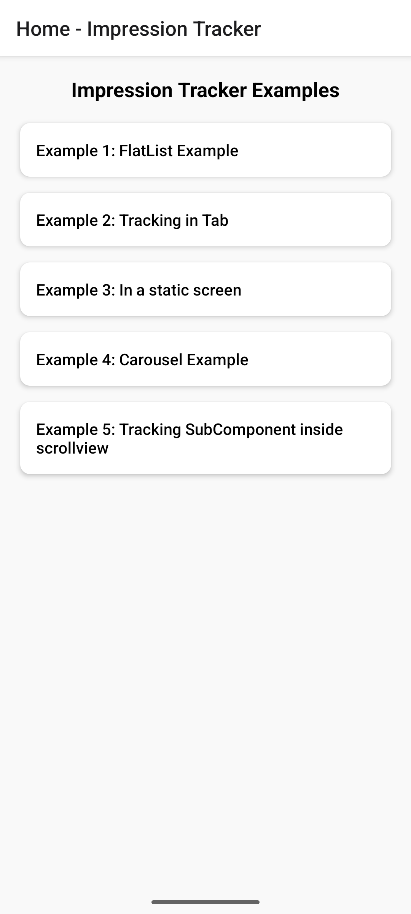

# react-native-impression-tracker

A lightweight, customizable React Native library for tracking **view-based impressions** and **ad interactions** within scrollable views.

---

## ✨ Features

- 🔍 Viewability-based impression tracking
- ⏱️ Configurable viewability threshold and dwell time
- 🧠 Context-driven click/impression tracking
- 🧩 Simple integration with any scrollable or list-based UI
- ⚛️ React Native compatible (Android & iOS)

---

## 📦 Installation

```bash
npm install react-native-impression-tracker
# or
yarn add react-native-impression-tracker
```


## 🚀 Usage

### Basic Example

```tsx
import React from 'react';
import { Text, View, ScrollView } from 'react-native';
import ImpressionTracker, {
  AdsClickedInterface,
} from 'react-native-impression-tracker';

const ExampleScreen = () => {
  const handleImpression = () => {
    console.log('Element became visible for long enough!');
  };

  const handleClick = (params: AdsClickedInterface) => {
    console.log('Ad clicked:', params);
  };

  return (
    <ScrollView>
      <ImpressionTracker
        onImpressionTrigger={handleImpression}
        onRealEstateClicked={handleClick}
        desiredImpressionTime={1000} // in ms
        desiredImpressionViewability={0.5} // 50% of component visible
      >
        <View style={{ height: 200, backgroundColor: 'lightblue' }}>
          <Text>Track Me</Text>
        </View>
      </ImpressionTracker>
    </ScrollView>
  );
};

export default ExampleScreen;

```
## 📸 Screenshots

### 🖼️ Example 1: Home - Impression Tracker Entry Points


### 🖼️ Example 2: Tracking SubComponent inside ScrollView


### 🖼️ Example 3: Tracking in Tab


## 📚 API Reference

### `<ImpressionTracker />`

Wrap any component to track its visibility and impressions.

#### Props

| Prop                          | Type                                      | Default | Description                                                                 |
|-------------------------------|-------------------------------------------|---------|-----------------------------------------------------------------------------|
| `onImpressionTrigger`         | `() => void`                              | —       | Called when the component is visible for the required time and viewability. |
| `onRealEstateClicked`         | `(params: AdsClickedInterface) => void`   | —       | Callback triggered when `handleClickForImpression` is called from a child.  |
| `desiredImpressionTime`       | `number`                                  | `1000`  | Duration in milliseconds the component must be visible to count as an impression. |
| `desiredImpressionViewability`| `number`                                  | `0.5`   | Proportion (0–1) of the view that must be visible (e.g. `0.5` = 50%).       |
| `rootMargin`                  | `number`                                  | `0`     | Optional margin around the component for visibility detection (in px).     |
| `style`                       | `ViewStyle`                               | —       | Optional style for the internal wrapper `<View>`.                           |

## 🧠 Context Hook: `useImpressionTracker`

The `useImpressionTracker` hook provides access to the `handleClickForImpression` function via context, allowing child components inside an `<ImpressionTracker>` to manually report click interactions tied to impression data.

### 🔄 How It Works

- This hook must be used inside an `<ImpressionTracker>` provider.
- It gives access to `handleClickForImpression`, which you can call with custom parameters (like ad ID, position, etc.).

### ✅ Example

```tsx
import React from 'react';
import { TouchableOpacity, Text } from 'react-native';
import { useImpressionTracker } from 'react-native-impression-tracker';

const AdTile = () => {
  const { handleClickForImpression } = useImpressionTracker();

  return (
    <TouchableOpacity
      onPress={() => handleClickForImpression({ adId: 'banner-001', position: 3 })}
    >
      <Text>Click Me</Text>
    </TouchableOpacity>
  );
};

```


## 🧪 Testing & Coverage

This project uses:

- **Jest** for unit and integration testing
- **@testing-library/react-native** for component interaction testing
- **TypeScript** for static type safety

### 🔧 Running Tests

To run all tests:

```bash
yarn test
# or
npm test
```

## 🤝 Contributing

Pull requests and contributions are welcome!

To contribute:

1. **Fork** the repository.
2. **Create** a new branch for your feature or bug fix:

   ```bash
   git checkout -b feature/my-awesome-feature
